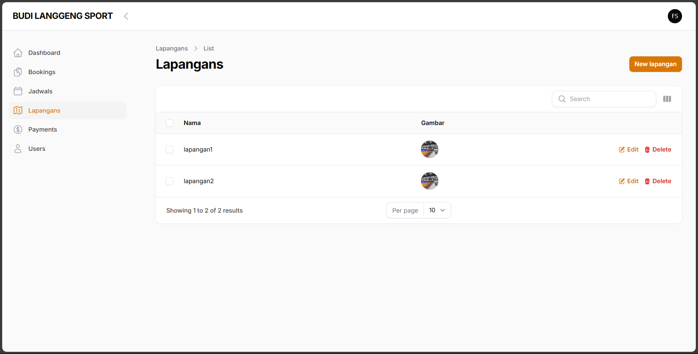

## **WIP**‼️‼️‼️

# CP FUTSAL

## KELOMPOK: ?

- ALJAWARI (L200220177)
- FAUZAN BAYU SAMUDRA (L200220223)
- DHELVIA LAILA FITRI (l200220185)
- APRIYANTO (l20022000)

---

**CP-FUTSALL** adalah aplikasi pemesanan lapangan futsal yang dirancang untuk mempermudah pengguna dalam melihat jadwal ketersediaan, melakukan booking secara real-time, dan mendapatkan konfirmasi otomatis. Aplikasi ini menawarkan antarmuka yang intuitif dan responsif, sehingga cocok digunakan oleh pengelola lapangan maupun pelanggan.

---

---

## 🔹 **Fitur Admin:**

- Pemesanan lapangan online dengan sistem jadwal real-time
- Notifikasi otomatis via email atau dashboard
- Manajemen data pengguna dan transaksi
- Panel admin interaktif untuk pengelolaan jadwal dan pembayaran
- Riwayat pemesanan dan status

## 🔹 **Fitur pengguna**

- Registrasi & login akun
- Lihat jadwal & ketersediaan lapangan
- Booking lapangan secara real-time
- Riwayat & status pemesanan
- Upload bukti pembayaran
- Notifikasi konfirmasi
- Edit profil pengguna
- Pembatalan booking
- Tampilan responsif mobile & desktop

---

## 🛠️ **Teknologi yang Digunakan:**

- **Laravel** sebagai backend framework
- **MySQL** untuk manajemen basis data
- **Livewire** Front End Symesly real time
- **Filament** sebagai admin panel modern dan dinamis
- **Tailwind** untuk desain antarmuka yang responsif

## Run secara Locally

Clone projek

```bash
  git clone git@github.com:urmommine/cp-futsall.git
```

Go to the project directory

```bash
  cd cp-futsall
```

Install dependencies

```bash
  cp .env.example .env
  composer install
  npm install && npm run dev
  php artisan key:generate

```

Jalankan server

```bash
  php artisan serve
```

Browser runs

```bash
 http://127.0.0.1:8000/admin
 username: fauzanbayu123@gmail.com
 pass    : password

 http://127.0.0.1:8000/login
 username: user@gmail.com
 pass    : password
```

## Screenshots

### Admin dashboard





### User dashboard


## License

[](https://choosealicense.com/licenses/mit/)
[](https://opensource.org/licenses/)
[](http://www.gnu.org/licenses/agpl-3.0)

## Authors

- [@tabbatyaba](https://www.instagram.com/tabbatyaba)

## Support

contact, email jovariteks@gmail.com
